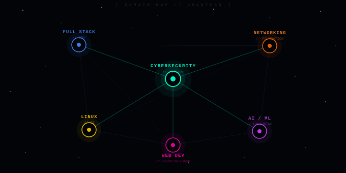

  

  

---

### 🛡️ Cybersecurity Student | Still figuring it out, one packet at a time

I'm a student who somehow ended up in cybersecurity and decided to stick around. I know my way around networking and have dabbled in web development, and now I'm slowly connecting the dots between building things and breaking them. Still figuring out a lot, but that's kind of the whole point.

- 🌍 Based in **India**
- 📬 Reach me at [shanthan6710@gmail.com](mailto:shanthan6710@gmail.com)
- 🔐 Currently learning: ethical hacking, network security & web vulnerabilities
- ⚡ Fun fact: I break things on purpose and call it research

---

### 🧰 Skills & Tools

---

### 🧠 Currently Learning

- 📡 Networking Protocols — diving deep into how things actually talk to each other
- 📜 **ISC2 CC** — Certified in Cybersecurity *(entry level, but it counts)*
- 🔐 **CompTIA Security+** — the one everyone tells you to get first

---

### 🚧 Projects

> Working on 'em... coming soon. 👀

| Project | Description | Status |
|--------|-------------|--------|
| 🔒 TBA | Something in the security space | `coming soon` |
| 🌐 TBA | Something web-related | `coming soon` |
| 🛠️ TBA | A tool. maybe. | `coming soon` |

*Check back later. Or don't. The repos will be here either way.*

---

### 🗂️ Portfolio

---

### 🌐 Socials

<a href="https://www.github.com/shancode669" target="_blank" rel="noreferrer">
  <picture>
    <source media="(prefers-color-scheme: dark)" srcset="https://raw.githubusercontent.com/danielcranney/readme-generator/main/public/icons/socials/github-dark.svg" />
    <source media="(prefers-color-scheme: light)" srcset="https://raw.githubusercontent.com/danielcranney/readme-generator/main/public/icons/socials/github.svg" />
    
  </picture>
</a>
<a href="https://www.linkedin.com/in/shanthan-sai-m" target="_blank" rel="noreferrer">
  <picture>
    <source media="(prefers-color-scheme: dark)" srcset="https://raw.githubusercontent.com/danielcranney/readme-generator/main/public/icons/socials/linkedin-dark.svg" />
    <source media="(prefers-color-scheme: light)" srcset="https://raw.githubusercontent.com/danielcranney/readme-generator/main/public/icons/socials/linkedin.svg" />
    
  </picture>
</a>

---

### 📊 GitHub Stats

  

  

---

### 👁️ Visitor Count

---

  

